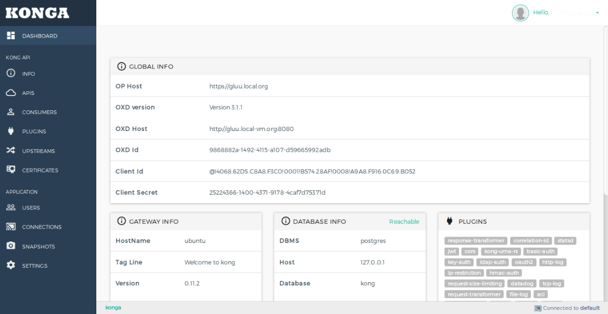

## Gluu Gateway

* The Gluu Gateway is the platform for protecting resources (Web application or API application) using the [Kong](https://getkong.org) plugins and proxy with konga GUI.

* Gluu Gateway has four components:
1. **[kong](https://getkong.org/)**: The open-source API Gateway and Microservices Management Layer, delivering high performance and reliability.
2. **[UMA Plugin](https://github.com/GluuFederation/gluu-gateway/tree/master/kong-uma-rs)**: Protect your resources by using UMA resource protection.
3. **[konga](https://github.com/GluuFederation/kong-plugins/tree/master/konga)**:  An admin GUI for calls [Kong admin API's](https://getkong.org/docs/0.11.x/admin-api/)
4. **[oxd](https://oxd.gluu.org)**: (optional) OAuth client service. It can be run locally or you can use an existing oxd server which is available via HTTPS.

## Features

1. Gluu-Gateway uses kong as the proxy gateway. So, It inherits all the features of kong.

| Legacy Architecture | Kong Architecture |
|---------------------|-------------------|
| :x: Common functionality is duplicated across multiple services | :white_check_mark: Kong centralizes and unifies functionality into one place |
| :x: Systems tend to be monolithic and hard to maintain | :white_check_mark: Build efficiently distributed architectures ready to scale |
| :x: Difficult to expand without impacting other services | :white_check_mark: Expand functionality from one place with a simple command |
| :x: Productivity is inefficient because of system constraints | :white_check_mark: Your team is focused on the product, Kong does the REST |

2. Gluu gateway provides KONGA GUI to operates kong very easily.


3. Dashboard to show all application configuration details in one
4. Add API(APIs which user want to protect by using kong plugins)
5. Protect API by kong-uma-rs plugin. kong-uma-rs plugin dealing with UMA Resource server to register and validate the resources.
6. Protect API by kong's default plugins. Example: basic-auth, key-auth, etc.
7. Manage all Kong Admin API Objects.
8. Access API by kong proxy and authenticated by security plugins
9. OAuth 2.0 authentication.
10. Import Consumers from remote sources (Databases, files, APIs etc.).
11. Manage multiple Kong Nodes.
12. Backup, restore and migrate Kong Nodes using Snapshots.
13. Monitor Node and API states using health checks.
14. Allow to configure kong-uma-rs plugin.
15. Gluu-Gateway uses oxd-server to dealing with OP server for authentication and resource management.


## Package Installation using Gluu repo
```
1. Add Gluu repo:
   # echo "deb https://repo.gluu.org/ubuntu/ trusty-devel main" > /etc/apt/sources.list.d/gluu-repo.list
   # curl https://repo.gluu.org/ubuntu/gluu-apt.key | apt-key add -

2. Add openjdk-8 PPA:
   # add-apt-repository ppa:openjdk-r/ppa

3. Add Postgresql repo:
   # echo "deb http://apt.postgresql.org/pub/repos/apt/ trusty-pgdg main" > /etc/apt/sources.list.d/psql.list
   # wget --quiet -O - https://www.postgresql.org/media/keys/ACCC4CF8.asc | sudo apt-key add -

4. Add Kong repo:
   # echo "deb https://kong.bintray.com/kong-community-edition-deb trusty main" > /etc/apt/sources.list.d/kong.list

5. Add node repo:
   # curl -sL https://deb.nodesource.com/setup_8.x | sudo -E bash -
   
6. Update your system and install the package:
   # apt-get update
   # apt-get install gluu-gateway
```


## Run Setup script

```
# cd /opt/gluu-gateway/setup
# python setup-gluu-gateway.py
```

You will be prompted to answer some questions. Just hit Enter to accept the default value, specified in square brackets. The following table should help you answer the questions correctly.

| Question | Explanation |
|----------|-------------|
| Enter IP Address | IP Address for kong configuration. |
| Enter Kong hostname | Internet-facing hostname, FQDN, or CNAME whichever your organization follows to be used to generate certificates and metadata. Do not use an IP address or localhost. |
| Country | Used to generate X.509 certificate for kong and konga. |
| State | Used to generate certificate for kong and konga. |
| City | Used to generate certificate for kong and konga. |
| Organization | Used to generate certificate for kong and konga. |
| Email | Used to generate certificate for kong and konga. |
| Password | Used for postgres database configuration. If you have already database user(i:e postgres) with password then enter existing password otherwise enter new password. |
| Would you like to configure oxd-server? | If you have already have oxd-server and oxd-https-extension then skip this configuration. |
| OP hostname | The hostname of your Gluu Sever (i.e. `your.domain.com`). |
| License Id | For oxd-server |
| Public key | For oxd-server |
| Public password | For oxd-server |
| License password | For oxd-server |
| oxd web url | Used to configure konga for the oxd-https-extension. Make sure oxd web url(oxd-https-extension) is in the running state, if not then start it manually. |
| Would you like to generate client_id/client_secret for konga? | You can register a new OpenID Client or enter manually enter existing client credentials. If you choose 'y' then make sure oxd web url(oxd-https-extension) is in the running state otherwise it does not allow to make new client. |
| oxd_id | Used to manually set oxd id for konga. |
| client_id | Used to manually set client id for konga. |
| client_secret | Used to manually set client secret for konga. |

```
Gluu Gateway configuration successful!!! https://localhost:1338
```
When you got this above message that means installation done successful. Next, process is to make tunnel to `https://localhost:1338` and use konga. If your port is open then you use konga directly in browser i:e `https://hostname:1338`.

> Note: After login, Go to `connection` tab and select the one kong node to use by clicking on the respective star icon.

## Configuration

### Configure kong
* You can configure kong by using kong.conf file.

```
/etc/kong/kong.conf
```
* Start/Stop/Restart
```
 # service kong [restart|stop|restart|status]
```

### Configure konga
* You can configure konga by setting properties in local.js file. This is used to set port, oxd, OP and client settings.
```
/opt/gluu-gateway/konga/config/local.js
```
* Start/Stop/Restart/Status
```
 # service gluu-gateway [start|stop|restart|status]
```

### Configure oxd

* Configure oxd-server
```
/opt/oxd-server/conf/oxd-conf.json
```
* Start/Stop/Restart/Status oxd-server
```
 # service oxd-server [start|stop|restart|status]
```

* Configure oxd-https-extension
```
/opt/oxd-https-extension/lib/oxd-https.yml
```
* Start/Stop/Restart/Status oxd-https-extension
```
 # service oxd-https-extension [start|stop|restart|status]
```

## KONGA Guide

> Note: After installation and first time login, Go to `connection` tab and select the one kong node to use by clicking on the respective star icon.

### 1. Dashboard

Dashboard section shows all application configuration details. You can see oxd and client details used by konga.


### 2. Info

Info section shows generic details about the kong node.


### 3. APIS

The API object describes an API that's being exposed by Kong. Kong needs to know how to retrieve the API when a consumer is calling it from the Proxy port. Each API object must specify a request host, a request path or both. Kong will proxy all requests to the API to the specified upstream URL.


Add your API by using `+ ADD NEW API` button. Add form shows details of every field.


For Add UMA RS plugin click on `SECURITY` option in apis list.


### 4. Consumers

The Consumer object represents a consumer - or a user - of an API. You can either rely on Kong as the primary datastore, or you can map the consumer list with your database to keep consistency between Kong and your existing primary datastore.


Add consumers by using `+ CREATE CONSUMER` button. Add form shows details of every field.


### 5. Plugins

A Plugin entity represents a plugin configuration that will be executed during the HTTP request/response workflow, and it's how you can add functionalities to APIs that run behind Kong, like Authentication or Rate Limiting for example.


Add Plugins by using `+ ADD GLOBAL PLUGINS` button.


### 6. Upstreams

The upstream object represents a virtual hostname and can be used to loadbalance incoming requests over multiple services (targets). So for example an upstream named service.v1.xyz with an API object created with an upstream_url=https://service.v1.xyz/some/path. Requests for this API would be proxied to the targets defined within the upstream.


Add Plugins by using `+ CREATE UPSTREAM` button.


### 7. CERTIFICATE

A certificate object represents a public certificate/private key pair for an SSL certificate. These objects are used by Kong to handle SSL/TLS termination for encrypted requests. Certificates are optionally associated with SNI objects to tie a cert/key pair to one or more hostnames.


Add Plugins by using `+ CREATE CERTIFICATE` button.


### 8. Connections

Create connections to Kong Nodes and select the one to use by clicking on the respective star icon.


Add Plugins by using `+ NEW CONNECTION` button.


### 9. Snapshots

Take snapshots of currently active nodes.
All APIs, Plugins, Consumers, Upstreams and Targetswill be saved and available for later import.
