Licensed under the [GLUU SUPPORT LICENSE](./LICENSE). Copyright Gluu 2018.

## Gluu Gateway

The Gluu Gateway is a package which can be used to quickly deploy an
OAuth protected API gateway with the following components:

1. **[Kong Community Edition](https://getkong.org/)**: The open-source API
Gateway and Microservices Management Layer, delivering high performance and
reliability.
2. **[Gluu Kong plugins](https://github.com/GluuFederation/gluu-gateway/)**:  
Use a Gluu Server to authenticate OAuth2 clients or to control access to
upstream API's.
3. **[Gluu Gateway Admin Portal](https://github.com/GluuFederation/kong-plugins/tree/master/konga)**:  
A web administration portal, based on [Konga](https://github.com/pantsel/konga),
that makes it easier to manage your Gluu Gateway.
4. **[oxd](https://oxd.gluu.org)**: OpenID Connect and UMA middleware service
used for client credential management and cryptographic validation.

## Features

1. Add | Edit | Delete API's
1. Restrict access to tokens with certain OAuth scopes
1. API Dashboard to configure and monitor the health of your servers.
1. Manage your API gateway cluster for high availability
1. Backup, restore and migrate Kong instances using snapshots
1. Leverages the security and upgradability of the oxd-server

## Versions

These instructions use the following versions:

1. Gluu server 3.1.2
1. oxd-server 3.1.2
1. Kong 0.11.x
1. OpenJDK 8
1. Python 2.x
1. Postgres 10
1. Node 8.9.4
1. npm 5.6.0

## Installation

Installation is a three part process:

1. Add required third party repositories
2. Install `gluu-gateway` package
3. Run `setup-gluu-gateway.py`

### Required Third Party repositories

```
1. Add Gluu repo:
   # echo "deb https://repo.gluu.org/ubuntu/ trusty-devel main" > /etc/apt/sources.list.d/gluu-repo.list
   # curl https://repo.gluu.org/ubuntu/gluu-apt.key | apt-key add -

2. Add openjdk-8 PPA:
   # add-apt-repository ppa:openjdk-r/ppa

3. Add Postgresql-10 repo:
   # echo "deb http://apt.postgresql.org/pub/repos/apt/ trusty-pgdg main" > /etc/apt/sources.list.d/psql.list
   # wget --quiet -O - https://www.postgresql.org/media/keys/ACCC4CF8.asc | sudo apt-key add -

4. Add Kong repo:
   # echo "deb https://kong.bintray.com/kong-community-edition-deb trusty main" > /etc/apt/sources.list.d/kong.list

5. Add Node repo:
   # curl -sL https://deb.nodesource.com/setup_8.x | sudo -E bash -

```

### Install gluu-gateway package

```
   # apt update
   # apt install gluu-gateway
```


### Run setup script

```
# cd /opt/gluu-gateway/setup
# python setup-gluu-gateway.py
```

You will be prompted to answer some questions. Just hit Enter to accept the
default value, specified in square brackets.

| Question | Explanation |
|----------|-------------|
| Enter IP Address | IP Address of your API gateway  |
| Enter Kong hostname | Internet-facing FQDN to generate certificates and metadata. Do not use an IP address or localhost. |
| Country | Used to generate web X.509 certificates |
| State | Used to generate web X.509 certificates |
| City | Used to generate web X.509 certificates |
| Organization | Used to generate web X.509 certificates |
| Email | Used to generate web X.509 certificates |
| Password | If you already have a database password for user `postgres`, enter it here, otherwise enter a new password. |
| Would you like to configure oxd-server? | If you already have oxd-web on the network, skip this configuration. |
| OP hostname | Used to configure the oxd default OP hostname. Many deployments use a single domain's OP service, so it makes sense to set it as the default. |
| License Id | From [oxd-server license](https://oxd.gluu.org/#pricing) |
| Public key | From [oxd-server license](https://oxd.gluu.org/#pricing) |
| Public password | From [oxd-server license](https://oxd.gluu.org/#pricing) |
| License password | From [oxd-server license](https://oxd.gluu.org/#pricing) |
| oxd https url | Make sure oxd-https-extension is running. |
| Would you like to generate client_id/client_secret for konga? | You can register a new OpenID Client or enter existing client credentials manually. You may want to extend the client expiration date if on the Gluu Server if you plan to use this service more then one day. If you enter existing client details then your client must have `https://localhost:1338` URL entry in Redirect Login URIs and Post Logout Redirect URIs. |
| oxd_id | Used to manually set oxd id. |
| client_id | Used to manually set client id. |
| client_secret | Used to manually set client secret. |

```
Gluu Gateway configuration successful!!! https://localhost:1338
```
If you see the above message it means installation was successful. To login
to the Gluu Gateway admin portal, create an ssh tunnel on port 1338 from your
workstation to the Gluu Gateway server, and point your browser at
`https://localhost:1338`

## Configuration

### Configure Gluu Gateway

The Gluu Gateway service used to manage all the gluu-gateway components (konga,
kong, postgres, oxd-server, oxd-https).

* Start/Restart/Status
```
 # service gluu-gateway [start|restart|status]
```

### Configure konga
* You can configure konga by setting properties in local.js file. This is used
to set port, oxd, OP and client settings.
```
/opt/gluu-gateway/konga/config/local.js
```
* Start/Stop/Restart/Status
```
 # service konga [start|stop|restart|status]
```

### Configure kong
* You can configure kong by using kong.conf file.

```
/etc/kong/kong.conf
```
* Start/Stop/Restart
```
 # service kong [restart|stop|restart|status]
```


### Configure oxd

* Configure oxd-server
```
/opt/oxd-server/conf/oxd-conf.json
```
* Start/Stop/Restart/Status oxd-server
```
 # service oxd-server [start|stop|restart|status]
```

* Configure oxd-https-extension
```
/opt/oxd-https-extension/lib/oxd-https.yml
```
* Start/Stop/Restart/Status oxd-https-extension
```
 # service oxd-https-extension [start|stop|restart|status]
```

### Restore KONG to factory default

Execute below following command in sequence

```
# kong stop
```

```
# kong migrations reset
```

```
# kong migrations up
```

```
# kong start
```

## KONGA Guide

### 1. Dashboard

Dashboard section shows all application configuration details. You can see oxd and client details used by konga.
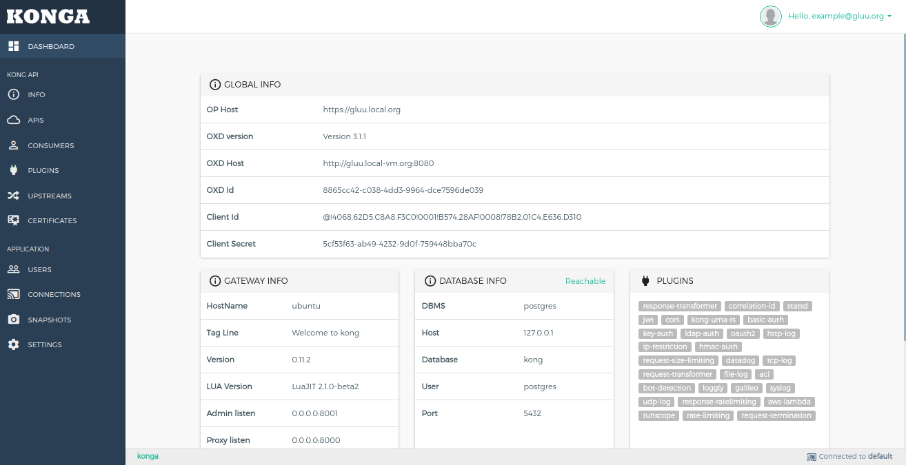

### 2. Info

Info section shows generic details about the kong node.
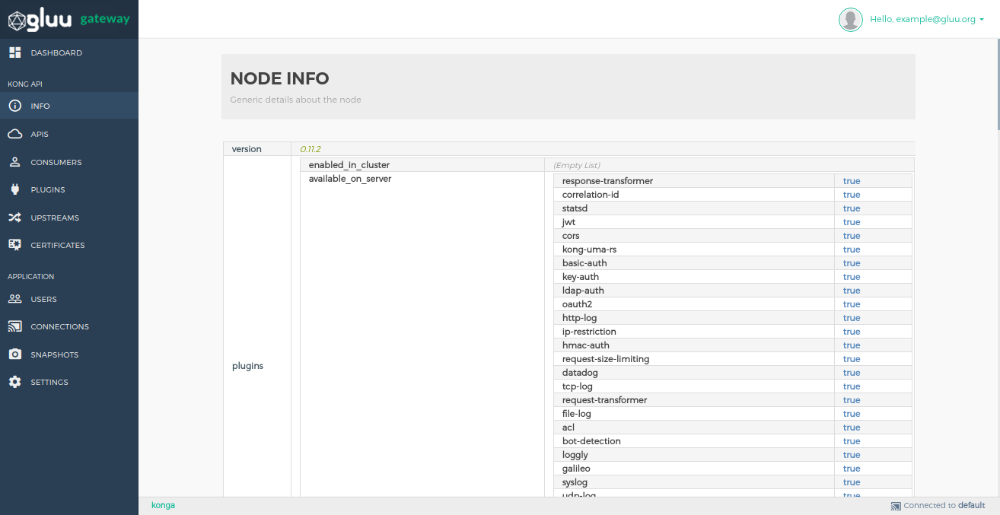

### 3. APIS

The API object describes an API that's being exposed by Kong. Kong needs to know how to retrieve the API when a consumer is calling it from the Proxy port. Each API object must specify a request host, a request path or both. Kong will proxy all requests to the API to the specified upstream URL.
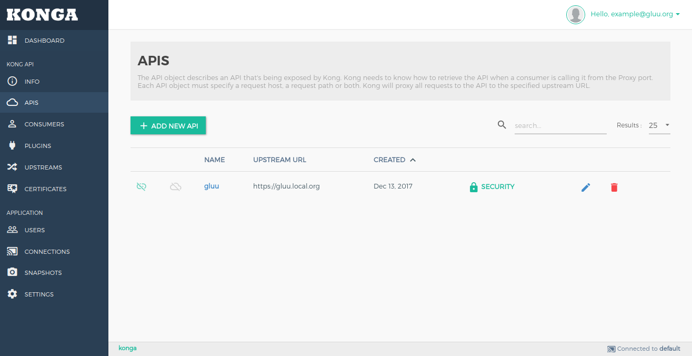

Add your API by using `+ ADD NEW API` button. Add form shows details of every field.


For Add UMA RS plugin click on `SECURITY` option in API's list.
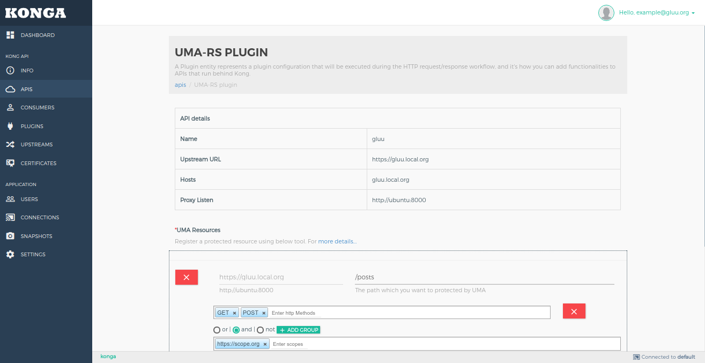

#### Manage plugins in APIS.

You need to go in manage mode in API section by click on pencil icon in API's list.

API's Plugin list
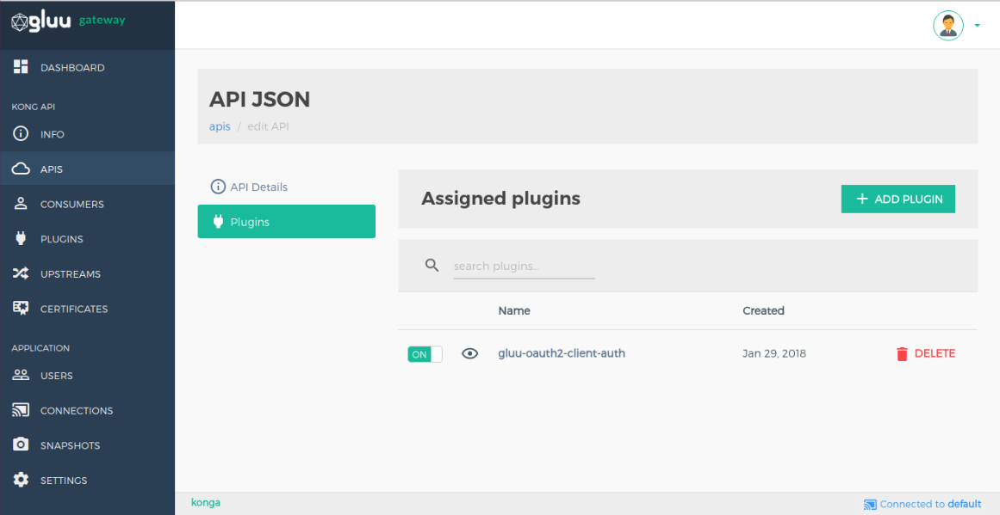

Add Plugin in API


### 4. Consumers

The Consumer object represents a consumer - or a user - of an API. You can either rely on Kong as the primary datastore, or you can map the consumer list with your database to keep consistency between Kong and your existing primary datastore.
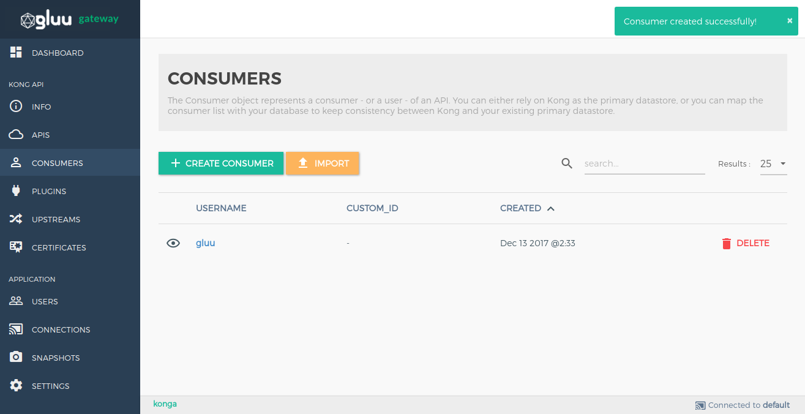

Add consumers by using `+ CREATE CONSUMER` button. Add form shows details of every field.
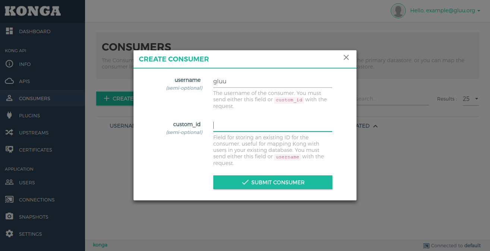

#### Consumer credential configuration

Some plugins are consumer based. It stores some plugin configuration in consumer credential. You need to go in consumer credential section by clicking on consumer `username`.
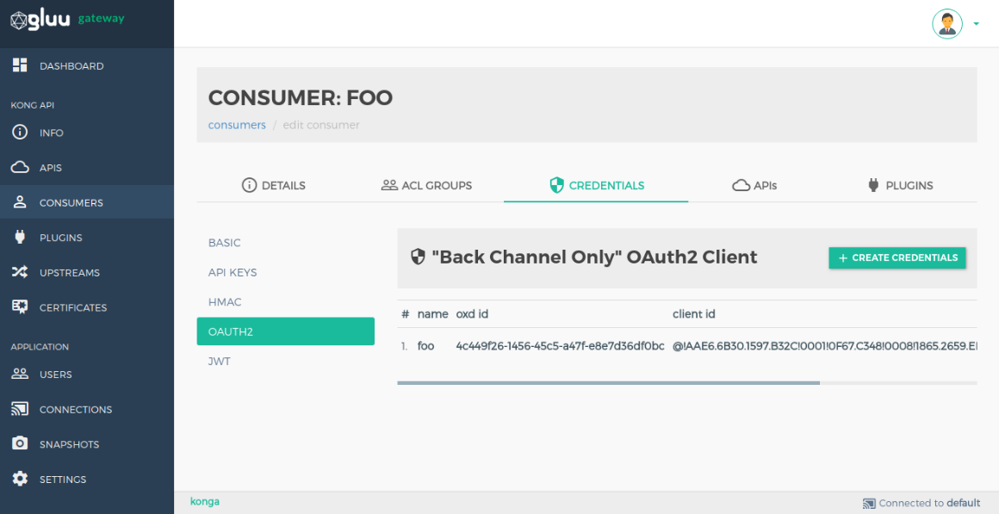

### 5. Plugins

A Plugin entity represents a plugin configuration that will be executed during the HTTP request/response workflow, and it's how you can add functionalities to APIs that run behind Kong, like Authentication or Rate Limiting for example.
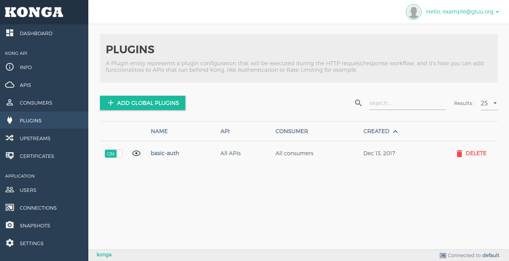

Add Plugins by using `+ ADD GLOBAL PLUGINS` button.
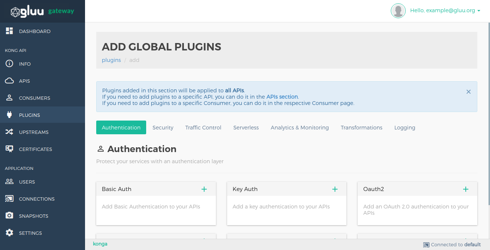

### 6. Upstreams

The upstream object represents a virtual hostname and can be used to loadbalance incoming requests over multiple services (targets). So for example an upstream named service.v1.xyz with an API object created with an upstream_url=https://service.v1.xyz/some/path. Requests for this API would be proxied to the targets defined within the upstream.
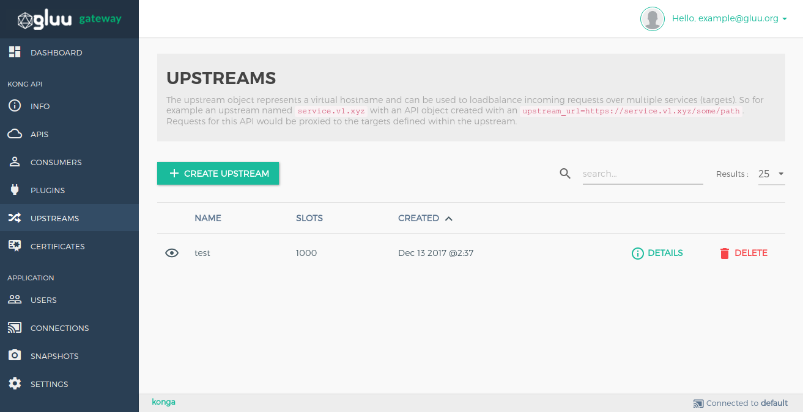

Add Plugins by using `+ CREATE UPSTREAM` button.
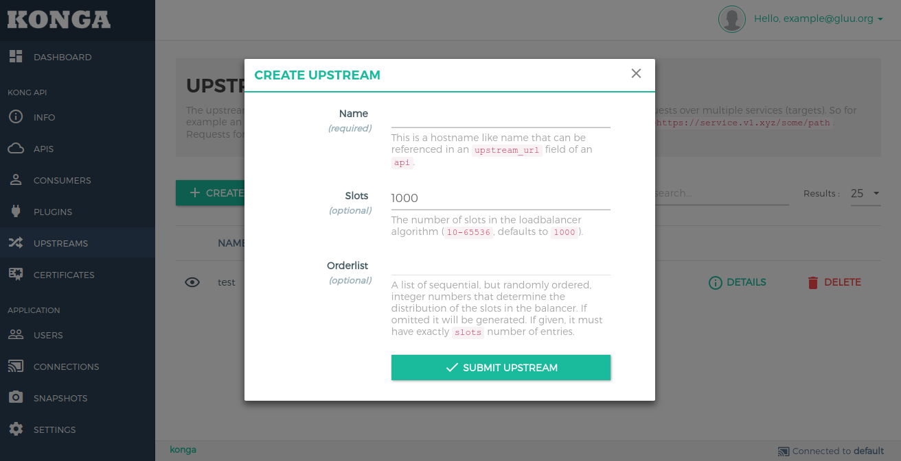

### 7. CERTIFICATE

A certificate object represents a public certificate/private key pair for an SSL certificate. These objects are used by Kong to handle SSL/TLS termination for encrypted requests. Certificates are optionally associated with SNI objects to tie a cert/key pair to one or more hostnames.
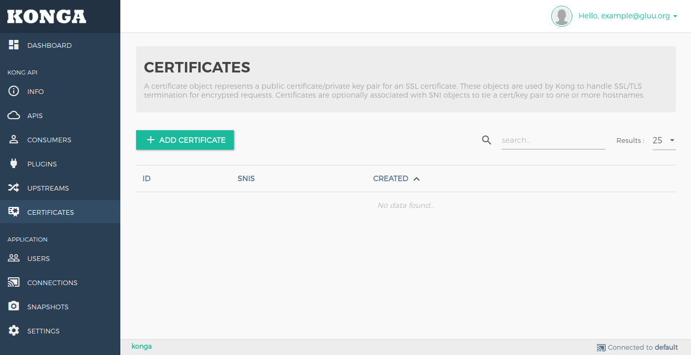

Add Plugins by using `+ CREATE CERTIFICATE` button.
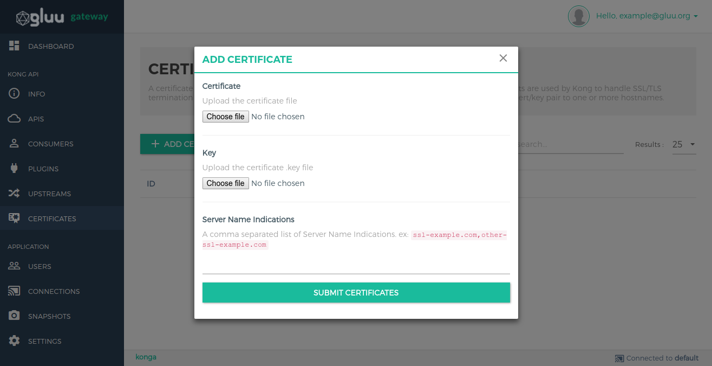

### 8. Connections

Create connections to Kong Nodes and select the one to use by clicking on the respective star icon.
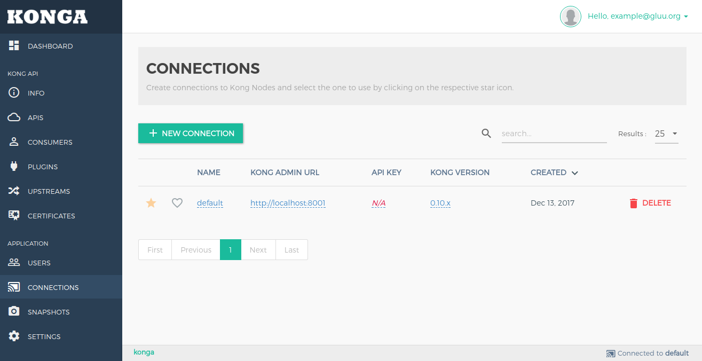

Add Plugins by using `+ NEW CONNECTION` button.
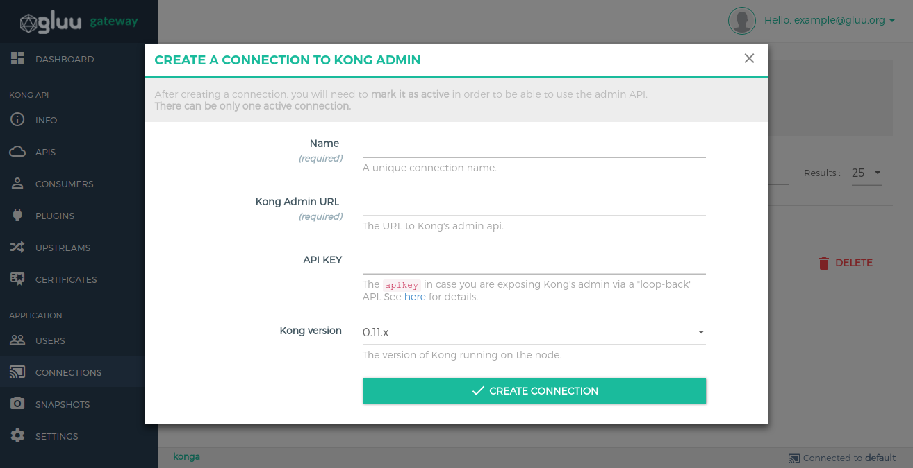

### 9. Snapshots

Take snapshots of currently active nodes.
All APIs, Plugins, Consumers, Upstreams and Targets will be saved and available for later import.
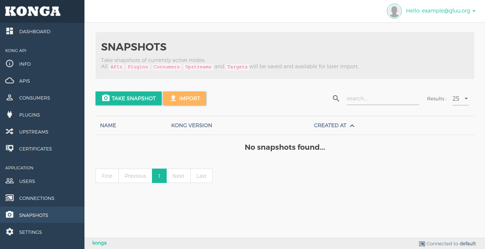
