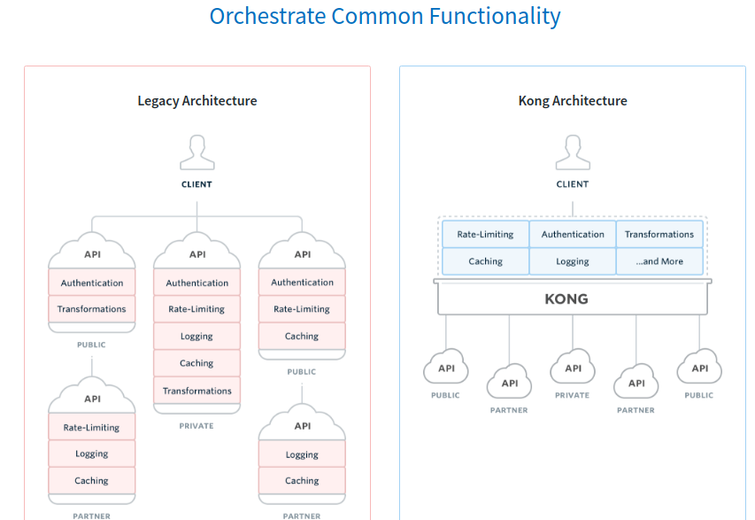

# Gluu-Gateway features

1. Gluu-Gateway uses kong as the proxy gateway. So, It inherits all the features of kong.

| Legacy Architecture | Kong Architecture |
|---------------------|-------------------|
| :x: Common functionality is duplicated across multiple services | :white_check_mark: Kong centralizes and unifies functionality into one place |
| :x: Systems tend to be monolithic and hard to maintain | :white_check_mark: Build efficient distributed architectures ready to scale |
| :x: Difficult to expand without impacting other services | :white_check_mark: Expand functionality from one place with a simple command |
| :x: Productivity is inefficient because of system constraints | :white_check_mark: Your team is focused on the product, Kong does the REST |

2. Gluu gateway provides KONGA GUI to operate kong very easily.

- Manage all Kong Admin API Objects.
- OAuth 2.0 authentication.
- Import Consumers from remote sources (Databases, files, APIs etc.).
- Manage multiple Kong Nodes.
- Backup, restore and migrate Kong Nodes using Snapshots.
- Monitor Node and API states using health checks.
- Allow configuration of kong-uma-rs plugin.

3. Gluu-Gateway provides custom kong-uma-rs plugin. kong-uma-rs plugin dealing with UMA Resource server to register and validate the resources.

4. Gluu-Gateway uses oxd-server dealing with OP server for authentication and resource management.
