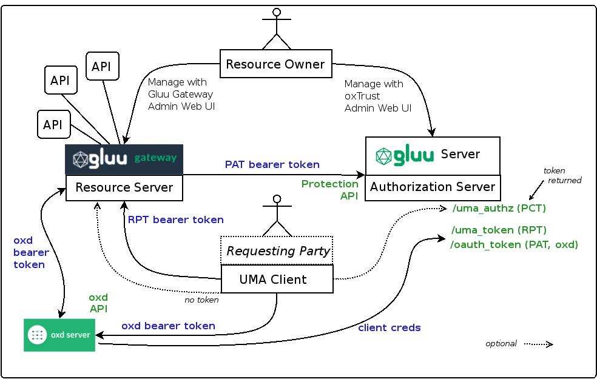
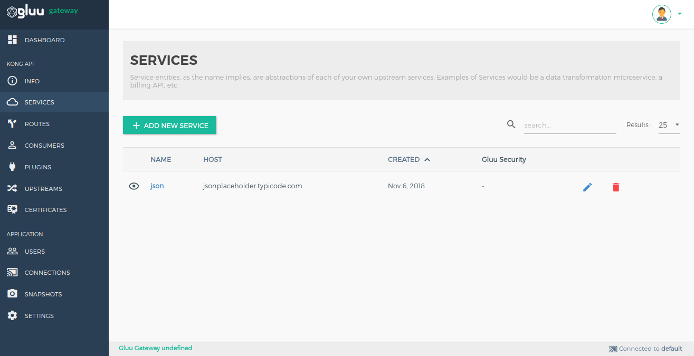
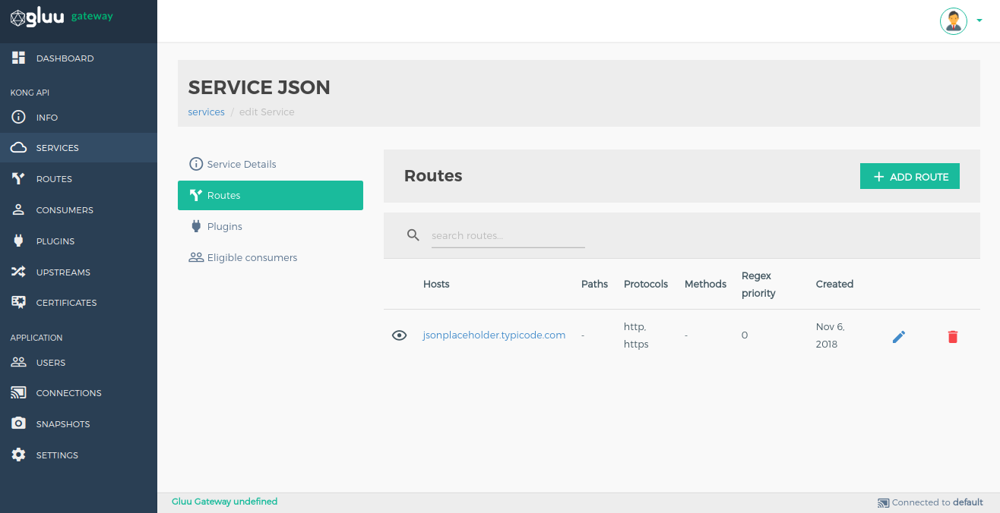
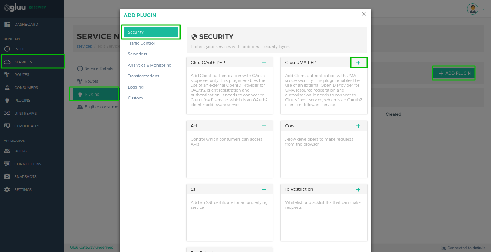
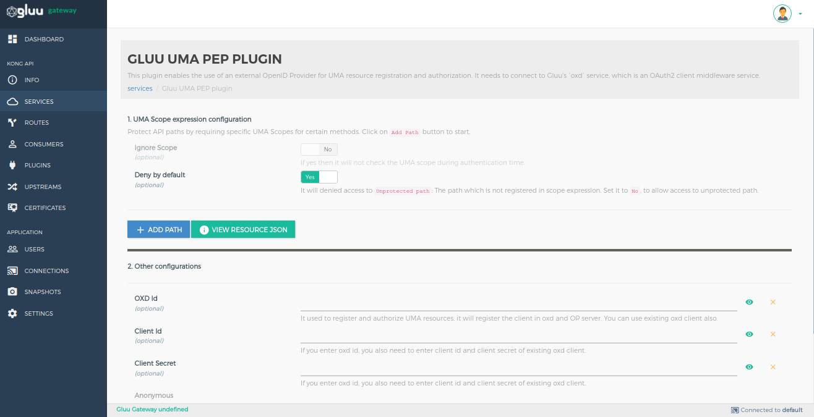
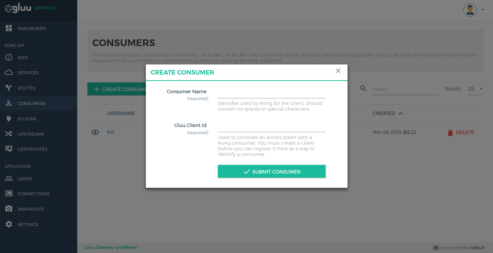

# Gluu Gateway UMA demo app

### 1. Parties



### 2. Flow


### 3. RS Configuration

RS configuration can be done either via REST calls or via Gluu Gateway web interface. You can configure plugin on **Service**, **Route** and **Global**. There are several possibilities for plugin configuration with services and routes. [More Details](https://docs.konghq.com/0.14.x/admin-api/#precedence). Take a look on [docs](https://gluu.org/docs/gg/plugin/gluu-uma-pep/) for configuration detail description.

Applications and their ports.

| Port | Description |
|------|-------------|
|8001|Kong Admin API|
|8000|Kong Proxt Endpoint|
|8443|OXD Server|


### Enable plugin on Service

#### 1. Add Service

##### 1.1 Add Service using GG UI

Use Service section to add service using GG UI.



##### 1.2 Add Service using Kong Admin API

```
$ curl -X POST \
  http://gg.example.com:8001/services \
  -H 'Content-Type: application/json' \
  -d '{
  "name": "<service_name>",
  "url": "http://upstream-api-url.com"
}'
```

#### 2. Add Route

##### 2.1 Add Route using GG UI

Use Manage Service Section to add route using GG UI.



##### 2.2 Add Route using Kong Admin API

```
$ curl -X POST \
    http://gg.example.com:8001/routes \
    -H 'Content-Type: application/json' \
    -d '{
    "hosts": [
      "<your_host.com>"
    ],
    "service": {
      "id": "<kong_service_object_id>"
    }
  }'
```

#### 2. Configure Plugin on Service

##### 2.1 Configure plugin using GG UI

Use the Manage Service section in GG UI to enable the Gluu UMA PEP plugin. In the security category, there is a Gluu UMA PEP box. Click on the **+ icon** to enable the plugin.



After clicking on **+ icon**, you will see the below form.


##### 2.2 Configure plugin using Kong Admin API

```
$ curl -X POST \
  http://gg.example.com:8001/plugins \
  -H 'Content-Type: application/json' \
  -d '{
  "name": "gluu-uma-pep",
  "config": {
    "oxd_url": "<your_oxd_server_url>",
    "op_url": "<your_op_server_url>",
    "oxd_id": "<oxd_id>",
    "client_id": "<client_id>",
    "client_secret": "<client_secret>",
    "uma_scope_expression": [
      {
        "path": "/posts",
        "conditions": [
          {
            "httpMethods": [
              "GET"
            ],
            "scope_expression": {
              "rule": {
                "and": [
                  {
                    "var": 0
                  },
                  {
                    "var": 1
                  }
                ]
              },
              "data": [
                "admin",
                "employee"
              ]
            }
          }
        ]
      }
    ],
    "ignore_scope": <false|true>,
    "deny_by_default": <false|true>,
    "hide_credentials": <false|true>
  },
  "service_id": "<kong_service_object_id>"
}'
```

!!! Note
    Kong not allow to proxy only using service object. you must have to add route for this. In short, you need one service to register Upstream API and one route for proxy.

### Parameters

Here is a list of all the parameters which can be used in this plugin's configuration.

| field | Default | Description |
|-------|---------|-------------|
|**op_url**||The URL of you OP server. Example: https://op.server.com|
|**oxd_url**||The URL of you OXD server. Example: https://oxd.server.com|
|**oxd_id**||It is used to introspect the token.|
|**client_id**|| It is used to get protection access token to access introspect API. If you enter oxd id, you also need to enter client id and client secret of existing oxd client.|
|**client_secret**||It is used to get protection access token to access introspect API. If you enter oxd id, you also need to enter client id and client secret of existing oxd client.|
|**uma_scope_expression**||It is used to add scope security on UMA scope token.|
|**ignore_scope**| false |It will not check any token scope during authentication time.|
|**deny_by_default**| true |This functionality is for the path which is not protected by UMA scope expression. If it is true then deny unprotected path otherwise allow.|
|**anonymous**||An optional string (consumer uuid) value to use as an “anonymous” consumer if authentication fails. If empty (default), the request will fail with an authentication failure 4xx. Please note that this value must refer to the Consumer id attribute which is internal to Kong, and not its custom_id.|
|**hide_credentials**|false|An optional boolean value telling the plugin to show or hide the credential from the upstream service. If true, the plugin will strip the credential from the request (i.e. the Authorization header) before proxying it.|

!!! Note
    GG UI provide facility to create client and register resources using OXD. If you are configuring plugin only using Kong Admin API then you need to create client and register resource using OXD APIs and pass same UMA Expression and client credential to Gluu-UMA-PEP plugin.

### 4. UMA client registration
UMA client registraion can be done either via REST calls or via Gluu Gateway UI.

### Create Client

Create a client using `Create client consumer section`. You can use OXD register-site API to create client.


### Create Consumer

You need to associate a client credential to an existing Consumer object. To create a Consumer use Consumer section.



Create consumer using Kong Admin API.

```
$ curl -X POST \
    http://gg.example.com:8001/consumers \
    -H 'Content-Type: application/json' \
    -d '{
  	"username": "<kong_consumer_name>",
  	"custom_id": "<gluu_client_id>"
  }'
```

### 5. Call UMA protected API without claim gatering

* Get resource ticket

```
  curl -X GET http://gg.example.com:8000/<YOUR_PATH>
      --Header "Host: <YOUR_HOST>"
```

From this call you get ticket in WWW-Authenticate header with permission ticket

* Get client access token using consumer credentials.

```
 curl -X POST https://gg.example.com:8443/get-client-token
    --Header "Content-Type: application/json"
    --data '{"client_id":"<YOUR_CONSUMER_ID>", "client_secret":"<YOUR_CONSUMER_SECRET>", "op_host":"<YOUR_OP_HOST>","scope":[<YOUR_SCOPES>]}'
```

From this call you get Consumer access token

* Get RPT token

```
  curl -X POST https://gg.example.com:8443/uma-rp-get-rpt
      --Header "Authorization: Bearer <CONSUMER_ACCESS_TOKEN>"
      --Header "Content-Type: application/json"
      --data '{"oxd_id": "<YOUR_CONSUMER_OXD_ID>","ticket":"<PERMISSION_TICKET>"}'
```
From this call you will get access token (RPT).

* Call UMA protected API

```
  curl -X GET http://gg.example.com:8000/<YOUR_PATH>
      --Header "Authorization: Bearer <YOUR_RPT>"
      --Header "Host: <YOUR_HOST>"
```

### 6. UMA flow with claims gathering

#### Prerequisites

* UMA scope with Authorization Policy


* Enabled UMA RPT Polices & UMA Claims Gathering


* Register RS with correct scope

* Get resource ticket

```
  curl -X GET http://gg.example.com:8000/<YOUR_PATH>
      --Header "Host: <YOUR_HOST>"
```

From this call you get ticket in WWW-Authenticate header with permission ticket.

* Get client access token using consumer credentials.

```
 curl -X POST https://gg.example.com:8443/get-client-token
    --Header "Content-Type: application/json"
    --data '{"client_id":"<YOUR_CONSUMER_ID>", "client_secret":"<YOUR_CONSUMER_SECRET>", "op_host":"<YOUR_OP_HOST>","scope":[<YOUR_SCOPES>]}'
```

From this call you get Consumer access token.

* Getting need_info ticket

```
  curl -X POST https://gg.example.com:8443/uma-rp-get-rpt
      --Header "Authorization: Bearer <CONSUMER_ACCESS_TOKEN>"
      --Header "Content-Type: application/json"
      --data '{"oxd_id": "<YOUR_CONSUMER_OXD_ID>","ticket":"<PERMISSION_TICKET>"}'
```

From this call you get need_info ticket and claims gathering url(redirect_user). You have to add your claims redirect uri as a url query parameter. You may need to add your claims redirect url to your client configuration in CE.

Next step is to request claim gatering url in browser and add country and city data, if all claim is ok then CE will redirect you to claim redirect uri with **new permission ticket**.

* Get RPT token with permission ticket

```
  curl -X POST https://gg.example.com:8443/uma-rp-get-rpt
      --Header "Authorization: Bearer <CONSUMER_ACCESS_TOKEN>"
      --Header "Content-Type: application/json"
      --data '{"oxd_id": "<YOUR_CONSUMER_OXD_ID>","ticket":"<NEW_PERMISSION_TICKET>"}'
```

From this call you will get access token (RPT).

* Call UMA protected API

```
  curl -X GET http://gg.example.com:8000/<YOUR_PATH>
      --Header "Authorization: Bearer <YOUR_RPT>"
      --Header "Host: <YOUR_HOST>"
```

### 7. Demo

Demo is prepared as python CGI script. You need to put it in some CGI enabled web server. Script is divided into 4 parts:

* index.py - main script
* helper.py - REST calls and HTML template
* config.py - custom configuration

By default, UMA flow is executed.

If you want to execute UMA with claims gathering flow, add `claim=true` parameter in your url.
