# Gluu Gateway Demo Flask Application

## Requirements

For this demo I will use the following VM's.

|Name                    |IP Address      |Hosts            |OS                                |
|------------------------|----------------|-----------------|----------------------------------|
|Resource Server         |192.168.56.1    |rs.mygluu.org    |Any OS on which Python/flask runs |
|Upstream Server         |192.168.56.101  |claim-gatering.mygluu.org, none-claim-gatering.mygluu.org | Any OS on which Python/flask runs|
|OpenID Connect Provider |192.168.56.102  |op.mygluu.org    |Any Linux supported by Gluu Server|
|Gluu Gateway            |192.168.56.104  |gg.mygluu.org    |Currently I use Ubuntu 16.04 LTS  |


Since I am using virtual IP/hosts I write the following content to file `/etc/hosts` on each machine

```
192.168.56.1 rs rs.mygluu.org
192.168.56.101 us claim-gatering.mygluu.org
192.168.56.101 us none-claim-gatering.mygluu.org
192.168.56.102 op op.mygluu.org
192.168.56.104 gg gg.mygluu.org

```

## Resource Server

I am assuing that Python and pip is installed on this server. Install Flask and pyOpenSSL

```
# pip install flask 
# pip install pyopenssl 
```

Download gg_demo_app.py:

`wget https://raw.githubusercontent.com/mbaser/gluu/master/gluu_gateway_demo/gg_demo_app.py`

Create `templates` directory and get template:
```
# mkdir templates
# wget https://raw.githubusercontent.com/mbaser/gluu/master/gluu_gateway_demo/templates/index.html -O templates/index.html
```

Edit set following varaibles in `gg_demo_app.py` file to fit your settings. 

```
gg_proxy_url = "http://gg.mygluu.org:8000"
oxd_host = "https://gg.mygluu.org:8443"
op_host = "https://op.mygluu.org"
api_path = "posts"

# Kong route register with below host
host_without_claims = "none-claim-gatering.mygluu.org"
host_with_claims = "claim-gatering.mygluu.org"
```


And run as:
`# python gluu_gateway_demo/gg_demo_app.py`


## Upstream Server

I am assuing that Python and pip is installed on this server. Install Flask and pyOpenSSL

```
# pip install flask 
# pip install pyopenssl 
``` 

Download gg_demo_app.py:


`wget https://raw.githubusercontent.com/mbaser/gluu/master/gluu_gateway_demo/gg_upstream_app.py`

And run as:
`# python gluu_gateway_demo/gg_upstream_app.py`

It will listen port 5000 of all interfaces. Test if it is running:

```
$ curl -k https://claim-gatering.mygluu.org:5000/posts
{
  "location": "https://claim-gatering.mygluu.org:5000/posts", 
  "message": "I am a test flask-api for Gluu Gateway", 
  "time": "Mon Jan 28 16:03:16 2019"
}
```


## OpenID Connect Provider

As OpenID Connect Provider I sue Gluu Server. Please install Gluu Server by following
instruction explained [here https://gluu.org/docs/ce/installation-guide/](https://gluu.org/docs/ce/installation-guide/)


## Gluu Gateway

For this demo, I used Gluu Gateway (GG) 4.0bta. Please install Gluu Gateway by following
instruction explained [here https://gluu.org/docs/gg/installation/](https://gluu.org/docs/gg/installation/)

GG UI is only available on localhost. Sice it is on a remote machine, we need ssh port forwarding
to reacg GG UI. My GG IP is 192.168.56.104, thus:

`$ ssh -L 1338:localhost:1338 user@gg.mygluu.org`

Where `user` is any username that can make ssh to GG host. On your desktop open a browser and navigate
to the following address:

https://localhost:1338

Your GG UI will come, login to GG UI with your Gluu Server **admin** credidentals.


### Create Consumer

The first thing is to create a consumer that will be used by Resource Server. For this, click **CONSUMERS**
on the left panel. Firstly we need to create a client for the consumer, click **+ CREATE CLIENT** button,
you just need to write **Client Name**, for this demo I wrote **ggconsumerclient**

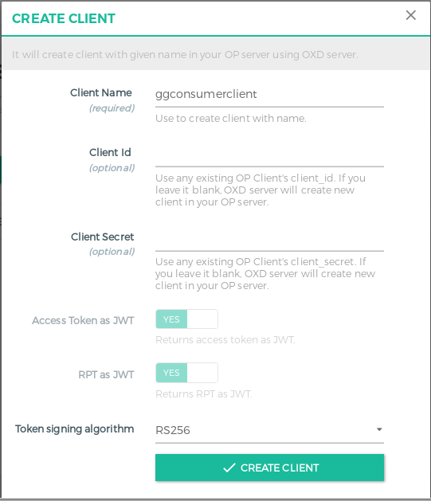

Once you hit, you will see credidentals for consumer client, before closing the pop-up screen please copy
credidental info:


To create a consumer, click on **+ CREATE CONSUMER** button. On the popup screen, write a name for consumer, 
I wrote **ggconsumer** and write `Client Id` you to **Gluu Client Id**

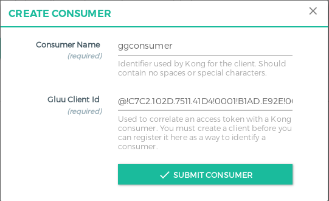


Edit `gg_demo_app.py` on your **Resource Server** and replace values of `client_oxd_id`, `client_id` and `client_secret`
those you get while creating client for consumer. Since it is in degub mode it, program will reload automatically
so you don't need to restart. In my case:

```
# Consumer client
client_oxd_id = "80e6c1f8-76cb-4601-afb8-19866ed2a29a"
client_id = "@!C7C2.102D.7511.41D4!0001!B1AD.E92E!0008!B021.E33B.3261.AF1E"
client_secret = "73039435-13f4-4999-904f-31a69e946195"
```

Before going further let us set Claim Redirect URI for this client, we weill need it for claim gatering service.
Login to Gluu Server, click on **OpenID Connect**, **Clients**. Click on **ggconsumerclient**, In the client details
screen, click **Advenced settings** tab, delete if there is any entries in **Claim Redirect URIs** field. Click on
**Add Claim Redirect URIs** button, on the pop-up write `https://rs.mygluu.org:5500/cg` to the textbox. After adding
reiderct uri, click **Update** button.


### Create Service, Route and Plugin for None Claim Gatering
#### Create Service
On GG UI, click **SERVICES** on the left panel, and then click **+ ADD NEW SERVICE** button. Please fill the
following boxes:
  
**Name:** none-claim-gatering

**Protocol:** https

**Host:** none-claim-gatering.mygluu.org

**Port:** 5000

**Path:** /posts

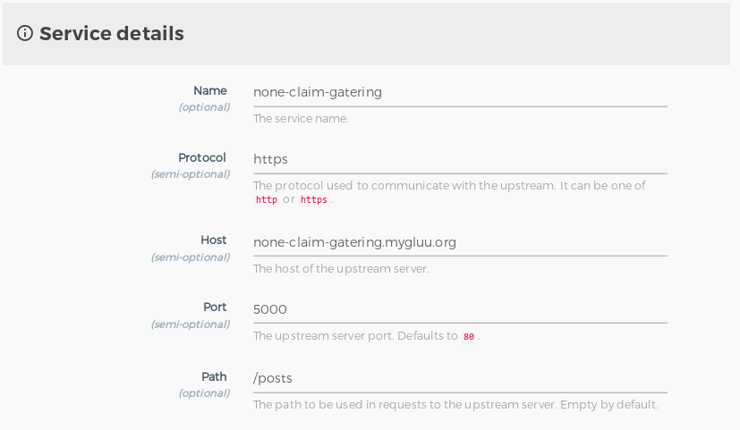

#### Add Route
Click **Routes** then click **+ ADD ROUTE** button. Fill the following boxes:

**Hosts:** none-claim-gatering.mygluu.org

**Paths:** /posts

Note: Once you write to textboxes press "Enter"
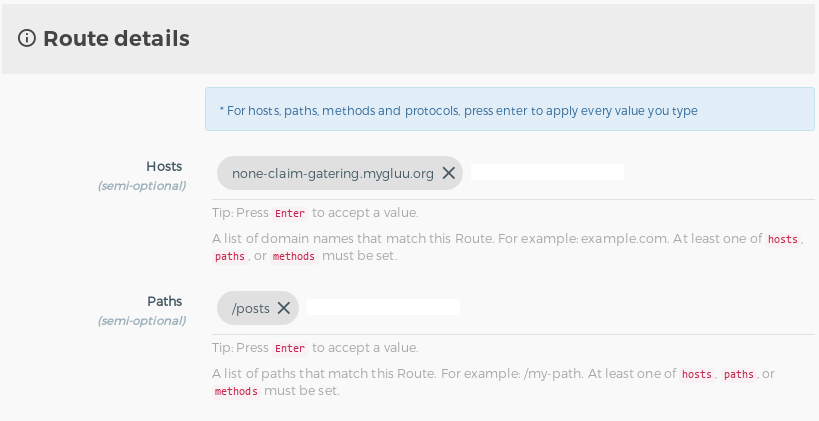

#### Add Plugin
Click **Plugins** then click **+ ADD PLUGIN** button. A pop-up screen will be displayed. Click **+** icon the the rigth 
side of **Gluu UMA PEP**. In the upcoming screen, click **+ ADD PATH** button. Write `/posts` to the path to be protected
and `none_claim_gatering` to the scope, remember you need to press "Enter" after writing scope. You don't need to write
anything on **Other configurations** settings. Click **ADD PLUGIN** button.

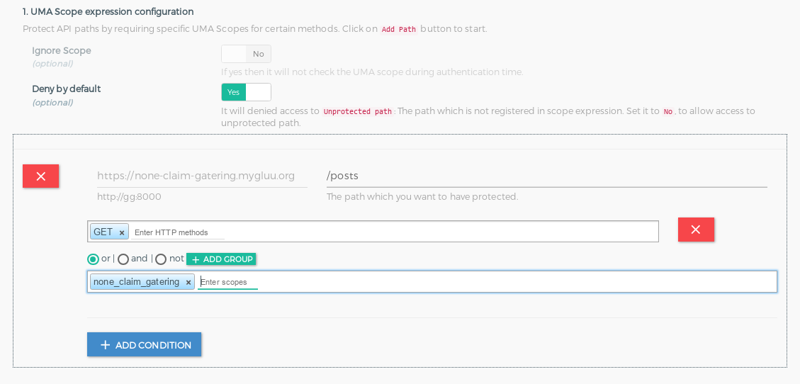

#### Gluu Server Tweaks
We need to give grant gccess to none policy scopes. Login to Gluu Server, click **Configuration**, **JSON Configuration**, then **oxAuth Configuration** tab. Scroll down until
**umaGrantAccessIfNoPolicies** set it to `true`

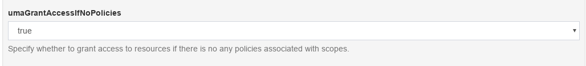


Finally test it. On your desktop navigate to the following url:

https://rs.mygluu.org:5500/nc

If everything goes well, you will see the following on your browser:

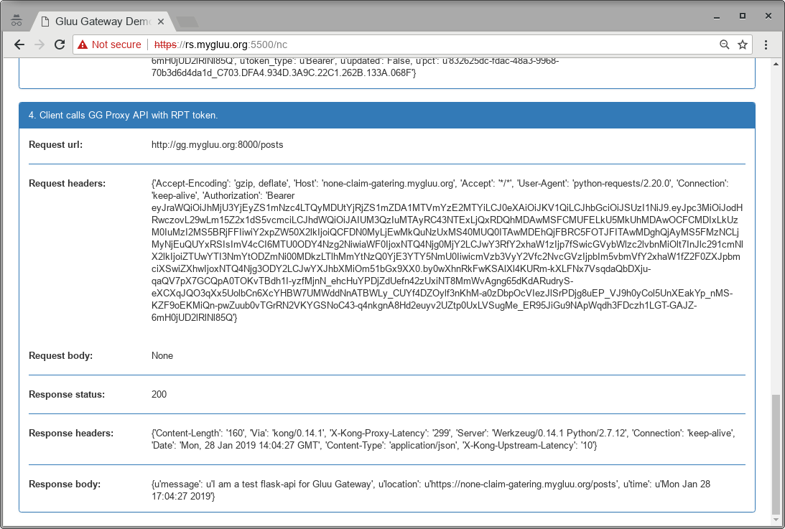

### Create Service, Route and Plugin for None Claim Gatering
#### Create Service
The same as None Claim Gatering, except Name and Host:

**Name:** claim-gatering  

**Host:** claim-gatering.mygluu.org

#### Add Route
The same as None Claim Gatering, except Hosts:

**Hosts:** claim-gatering.mygluu.org

#### Add Plugin
The same as None Claim Gatering, except scope, please write `claim_gatering` to scope as follows:

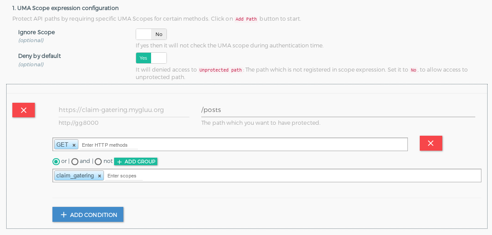


#### Gluu Server Tweaks
Login to Gluu Server. To enable uma_rpt_policy custom script, click  **Configuration**, **Manage Custom scripts**, then 
click **UMA RPT Policies** tab. Expand **uma_rpt_policy** custom script pane, scroll down and click **Enabled** checkbox.
Click **Update** button. Secondly, do the same for custom script `sampleClaimsGathering` on **UMA Claims Gathering** tab. 
Thirdly, we need to add `uma_rpt_policy` policy to `claim_gatering` Uma Scope. For this click **UMA** on the left panel, then
click on scopes. Click on `claim_gatering` scope. In the sope details screen, click **Add Authorization Policy**. In the popup
check `uma_rpt_policy`.

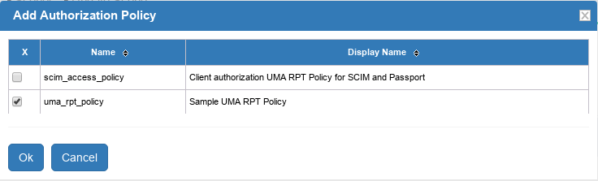

Finally click **Update** button.

Test it! On your desktop navigate to the following url:

https://rs.mygluu.org:5500/cg

If things goes well, you will get a link to gather claims at the end of the window:

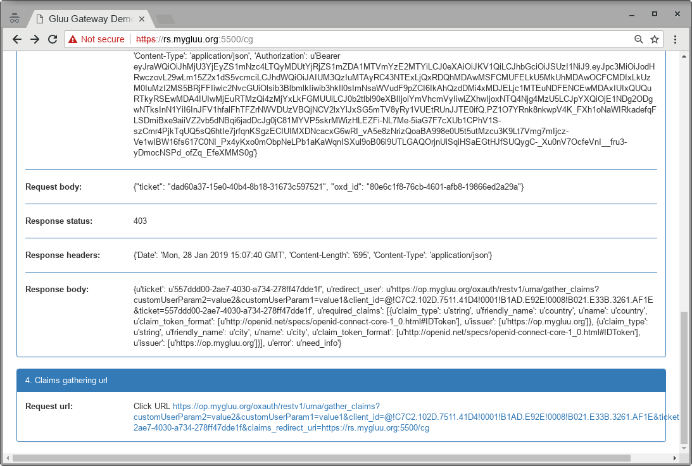

Click the link, you will be asked Country, enter `US`, then for City enter `NY`. You will be rederected to resourse server,
and will see:

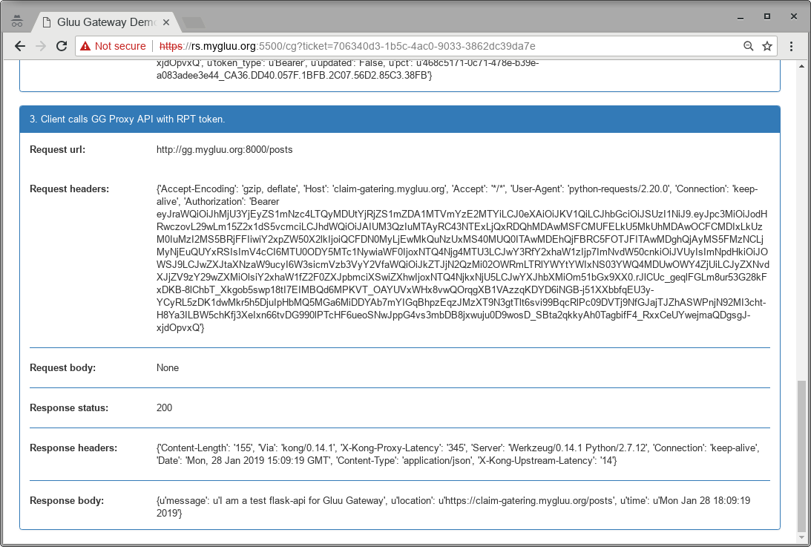


