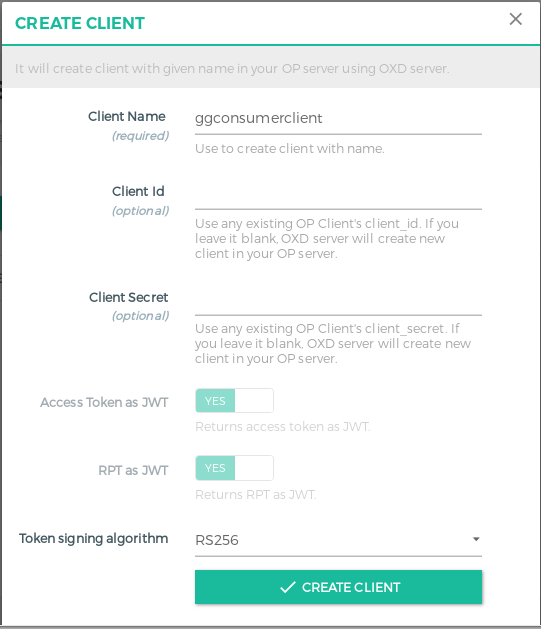
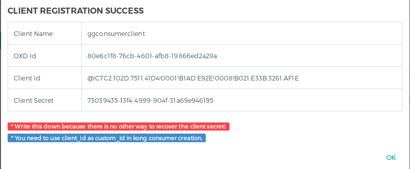
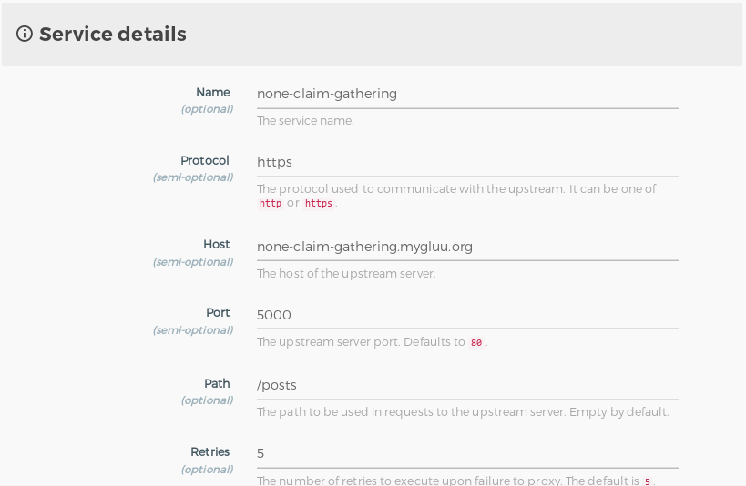
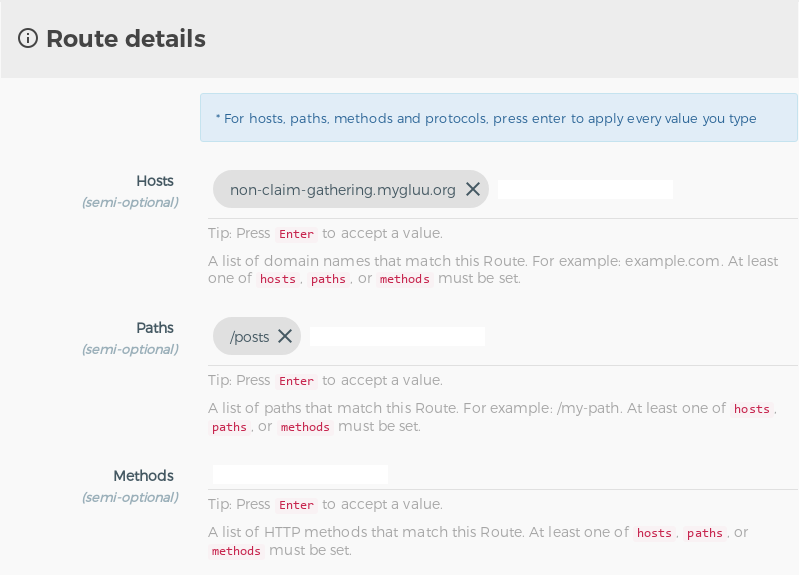
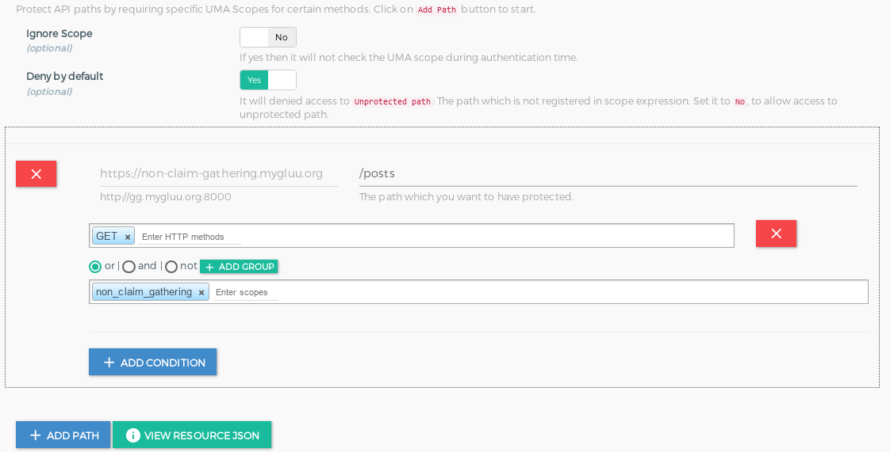
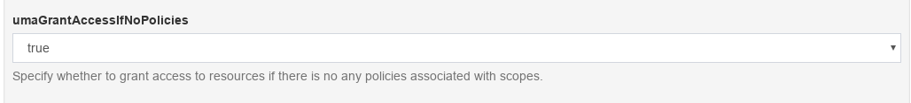
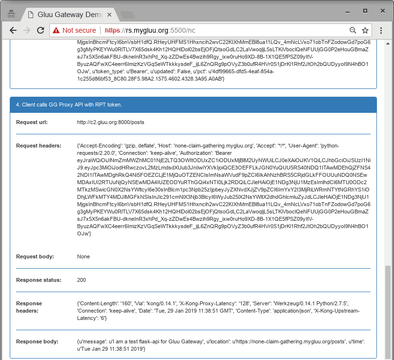
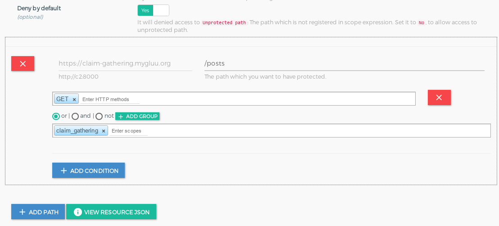
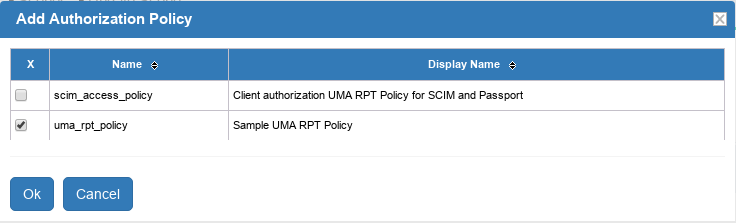
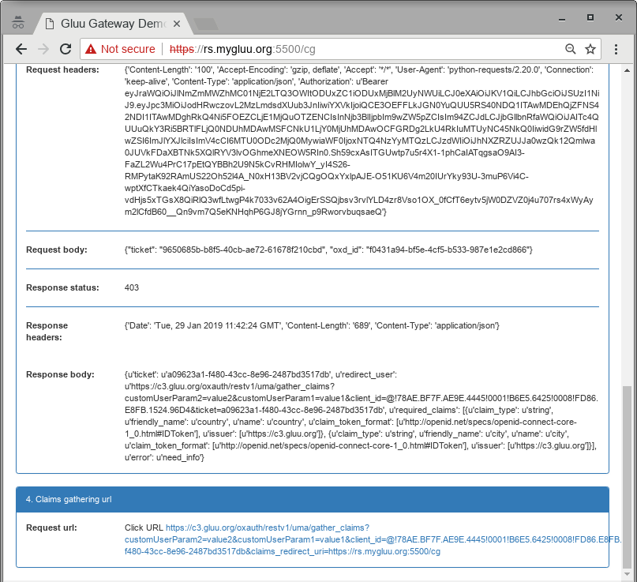

# Gluu Gateway Demo Flask Application

## Requirements

For this demo I will use the following VMs:

|Name                    |IP Address      |Hosts            |OS                                |
|------------------------|----------------|-----------------|----------------------------------|
|Resource Server         |192.168.56.1    |rs.mygluu.org    |Any OS on which Python/flask runs |
|Upstream Server         |192.168.56.101  |claim-gatering.mygluu.org, none-claim-gatering.mygluu.org | Any OS on which Python/flask runs|
|OpenID Connect Provider |192.168.56.102  |op.mygluu.org    |Any Linux supported by Gluu Server|
|Gluu Gateway            |192.168.56.104  |gg.mygluu.org    |Currently I use Ubuntu 16.04 LTS  |


Since I am using virtual IPs/hosts, I need to add the following content to the `/etc/hosts` file on each machine:

```
192.168.56.1   rs rs.mygluu.org
192.168.56.101 us claim-gatering.mygluu.org
192.168.56.101 us none-claim-gatering.mygluu.org
192.168.56.102 op op.mygluu.org
192.168.56.104 gg gg.mygluu.org
```

## Resource Server

I am assuming that Python and pip are installed on this server. Install Flask and pyOpenSSL:

```
# pip install flask 
# pip install pyopenssl 
```

Download gg_demo_app.py:

`wget https://raw.githubusercontent.com/GluuFederation/gluu-gateway/version_4.0.0/gluu_flask_demo/gg_demo_app.py`

Create a `templates` directory and get the template:
```
# mkdir templates
# wget https://raw.githubusercontent.com/GluuFederation/gluu-gateway/version_4.0.0/gluu_flask_demo/templates/index.html -O templates/index.html
```

Edit the following variables in `gg_demo_app.py` file to match your settings:

```
gg_proxy_url = "http://gg.mygluu.org:8000"
oxd_host = "https://gg.mygluu.org:8443"
op_host = "https://op.mygluu.org"
api_path = "posts"

# Kong route register with below host
host_without_claims = "none-claim-gatering.mygluu.org"
host_with_claims = "claim-gatering.mygluu.org"
```

And run as:

`# python gg_demo_app.py`


## Upstream Server

I am assuming that Python and pip are installed on this server. Install Flask and pyOpenSSL:

```
# pip install flask 
# pip install pyopenssl 
``` 

Download gg_demo_app.py:


`wget https://raw.githubusercontent.com/GluuFederation/gluu-gateway/version_4.0.0/gluu_flask_demo/gg_upstream_app.py`

And run as:

`# python gg_upstream_app.py`

It will listen on port 5000 of all interfaces. Test to see if it's running:

```
$ curl -k https://claim-gatering.mygluu.org:5000/posts
{
  "location": "https://claim-gatering.mygluu.org:5000/posts", 
  "message": "I am a test flask-api for Gluu Gateway", 
  "time": "Mon Jan 28 16:03:16 2019"
}
```

## OpenID Connect Provider

For the OpenID Connect Provider, I used the Gluu Server. Install the Gluu Server by following [these](https://gluu.org/docs/ce/installation-guide/) instructions.


## Gluu Gateway

For this demo, I used Gluu Gateway (GG) 4.0 Beta. Install Gluu Gateway by following [these](https://gluu.org/docs/gg/installation/) instructions.

The GG UI is only available on localhost. Since it is on a remote machine, we need SSH port forwarding
to reach the GG UI. For example, my GG IP is 192.168.56.104, so I do the following:

`$ ssh -L 1338:localhost:1338 user@gg.mygluu.org`

where `user` is any username that can SSH to the GG host. On your desktop, open a browser and navigate
to your GG UI at the following address:

https://localhost:1338

Log in with your Gluu Server **admin** credentials.

### Create Consumer

You'll need to create a consumer that will be used by the Resource Server. To do so, click **CONSUMERS**
on the left panel. First, you need to create a client for the consumer, click the **+ CREATE CLIENT** button.
Give it a unique **Client Name**, for this demo, I used **ggconsumerclient**.



Once you create the client, you will see credentials for the consumer client. Copy
the credential info for later use.



To create a consumer, click on **+ CREATE CONSUMER** button. On the popup screen, name the consumer, **ggconsumer** for example, and use the `Client Id` you just created for the **Gluu Client Id** field.


Edit `gg_demo_app.py` on your **Resource Server** and replace the `client_oxd_id`, `client_id` and `client_secret` values with those generated when you created the client for the consumer. Since it is in debug mode, the program will reload automatically with no need to restart. In my case:

```
# Consumer client
client_oxd_id = "80e6c1f8-76cb-4601-afb8-19866ed2a29a"
client_id = "@!C7C2.102D.7511.41D4!0001!B1AD.E92E!0008!B021.E33B.3261.AF1E"
client_secret = "73039435-13f4-4999-904f-31a69e946195"
```

Before going further, set the Claim Redirect URI for this client. You'll need it for the claim gathering service. Log in to  the Gluu Server, and navigate to **OpenID Connect** > **Clients** and click on your client. In the details screen, click the **Advanced settings** tab. If there are any entries in the **Claim Redirect URIs** field, delete them. Click the **Add Claim Redirect URIs** button and enter `https://rs.mygluu.org:5500/cg` in the textbox. After adding the redirect URI, click the **Update** button.

### Create Service, Route and Plugin for None Claim Gathering
#### Create Service
On GG UI, click **SERVICES** on the left panel, then the **+ ADD NEW SERVICE** button. Fill in the following boxes:
  
**Name:** none-claim-gathering

**Protocol:** https

**Host:** none-claim-gathering.mygluu.org

**Port:** 5000

**Path:** /posts



#### Add Route
Click **Routes**, then the **+ ADD ROUTE** button. Fill in the following boxes:

**Hosts:** none-claim-gathering.mygluu.org
**Paths:** /posts

Note: Once you write to textboxes press "Enter"


#### Add Plugin
Click **Plugins** then click **+ ADD PLUGIN** button. A pop-up screen will be displayed. Click the **+** icon to the right side of **Gluu UMA PEP**. In the upcoming screen, click the **+ ADD PATH** button. Write `/posts` to the path to be protected and `none_claim_gatering` to the scope, remember you need to press "Enter" after writing scope. You don't need to write anything on **Other configurations** settings. Click **ADD PLUGIN** button.



#### Gluu Server Tweaks
We need to give grant gccess to none policy scopes. Login to Gluu Server, click **Configuration**, **JSON Configuration**, then **oxAuth Configuration** tab. Scroll down until
**umaGrantAccessIfNoPolicies** set it to `true`




Finally test it. On your desktop navigate to the following url:

https://rs.mygluu.org:5500/nc

If everything goes well, you will see the following on your browser:



### Create Service, Route and Plugin for None Claim Gatering
#### Create Service
The same as None Claim Gatering, except Name and Host:

**Name:** claim-gatering  

**Host:** claim-gatering.mygluu.org

#### Add Route
The same as None Claim Gatering, except Hosts:

**Hosts:** claim-gatering.mygluu.org

#### Add Plugin
The same as None Claim Gatering, except scope, please write `claim_gatering` to scope as follows:




#### Gluu Server Tweaks
Login to Gluu Server. To enable uma_rpt_policy custom script, click  **Configuration**, **Manage Custom scripts**, then 
click **UMA RPT Policies** tab. Expand **uma_rpt_policy** custom script pane, scroll down and click **Enabled** checkbox.
Click **Update** button. Secondly, do the same for custom script `sampleClaimsGathering` on **UMA Claims Gathering** tab. 
Thirdly, we need to add `uma_rpt_policy` policy to `claim_gatering` Uma Scope. For this click **UMA** on the left panel, then
click on scopes. Click on `claim_gatering` scope. In the sope details screen, click **Add Authorization Policy**. In the popup
check `uma_rpt_policy`.



Finally click **Update** button.

Test it! On your desktop navigate to the following url:

https://rs.mygluu.org:5500/cg

If things goes well, you will get a link to gather claims at the end of the window:



Click the link, you will be asked Country, enter `US`, then for City enter `NY`. You will be rederected to resourse server,
and will see:


