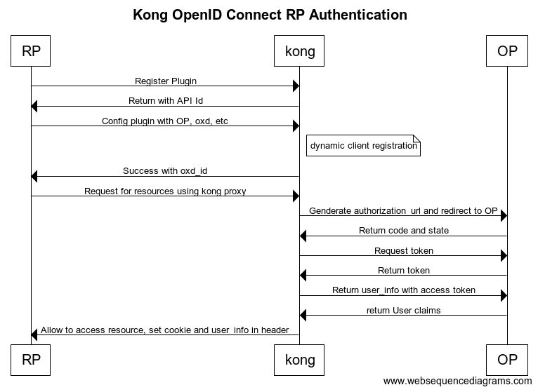

# Kong OpenID Connect RP plugin

The Kong OpenID Connect RP or OAuth 2.0 plugin allows you to protect your API (which is proxied by Kong) with [OpenID Connect](https://gluu.org/docs/ce/admin-guide/openid-connect/).

Table of Contents
=================

 * [Installation](#installation)
 * [Configuration](#configuration)
 * [Protect your API with OpenID Connect RP](#protect-your-api-with-Openid-connect-rp)
   * [Sequence flow](#sequence-flow)
   * [Add your API server to kong /apis](#add-your-api-server-to-kong-apis) 
   * [Config plugin](#config-plugin)
   * [Verify that your resources is protected by kong-openid-rp](#verify-that-your-api-is-protected-by-kong-openid-rp)
   * [Upstream Headers](#upstream-headers)
 * [References](#references)
  
## Installation

1. [Install Kong](https://getkong.org/install/)
2. [Install oxd server](https://oxd.gluu.org/docs/) 
3. Install kong-openid-rp
  1. Stop kong : `kong stop`
  2. Copy `kong-openid-rp/kong/plugins/kong-openid-rp` Lua sources to kong plugins folder `kong/plugins/kong-openid-rp`
  3. Enable plugin in your `kong.config` (typically located at `/etc/kong/kong.config`) and start kong `kong start`.
```
 custom_plugins:
   - kong-openid-rp
```

## Configuration
 - op_host - REQUIRED, Openid Connect Server that provides openid connect oauth facility. Op must be https.
                                            (For example [Gluu Server](https://www.gluu.org/gluu-server/overview/)). 
                                            Check that UMA implementation is up and running by visiting `.well-known/openid-configuration` endpoint.
 - client_id - OPTIONAL, client_id of OAuth client
 - client_secret - OPTIONAL, client_secret of OAuth client
 - authorization_redirect_uri - REQUIRED, This is the URL on your website that the OpenID Connect Provider (OP) will redirect the person to after successful authorization.
 - oxd_host - REQUIRED, host of the oxd server (default: localhost. It is recommended to have oxd server on localhost.)
 - oxd_port - REQUIRED, port of the oxd server (oxd server default port is 8099)
 - scope - REQUIRED, It is the user claims which you want in user information.

You can also passed some extra parameters. For detail refer [oxd-config](https://gluu.org/docs/oxd/protocol/#register-site)

## Protect your API with OpenID Connect RP

### Sequence flow


### Add your API server to kong /apis
OpenID connect standards always use https so you need to use secure port of kong. Details [kong-proxy](https://getkong.org/docs/0.10.x/proxy/)

```curl
$ curl -i -X POST \
  --url https://localhost:8444/apis/ \
  --data 'name=your.api.server' \
  --data 'upstream_url=https://your.api.server.com/' \
  --data 'hosts=your.api.server.com'
```

Successful response must confirm the API is added

### Config plugin

Config plugin with resources using kong admin API and get OXD ID. If you dont't pass client_id and client_secret, It will create new client. we require to pass 'api_id' and 'name' key in data with other config values.

```
curl -i -X POST \
 --url https://localhost:8444/apis/9dd75a96-af37-4136-8621-2395f8a42975/plugins/ \
 --data 'name=kong-openid-rp' \
 --data 'config.op_host=https://op.org' \
 --data 'config.oxd_port=8099' \
 --data 'config.oxd_host=localhost' \
 --data 'config.scope=openid,profile' \
 --data 'config.client_name=kong_test' \
 --data 'config.authorization_redirect_uri=https://localhost:8443' \
```

Successful response must confirm the API is added

### Verify that your resources is protected by kong-openid-rp
Verify your resource is correctly proxied via Kong. Kong provide by default proxy on secure port 8443 means every time request is handle by kong first on port 8443.

```
https://localhost:8443
```

Use this URL and request in browser. It will redirect you to OP for authentication and If the credential is currect then it will redirect back to our site and granted to access resources.

### Upstream Headers
When a client has been authenticated, the plugin will append some headers to the request before proxying it to the upstream API/Microservice, so that you can identify the Consumer in your code:
 - `X-OXD`, It is the configuration info. which we done in plugin configuration process
 - `X-USER-INFO`, The user claims, which return from OP after authentication is done. 

You can use this information on your side to implement additional logic. 
You can use the `X-OXD` or `X-USER-INFO` value to query the Kong Admin API and retrieve more information about the Consumer.

## References
 - [Kong](https://getkong.org)
 - [oxd server](https://oxd.gluu.org)
 - [Gluu Server](https://www.gluu.org/gluu-server/overview/)
 - [OpenId Connect specification](https://gluu.org/docs/ce/admin-guide/openid-connect/)
