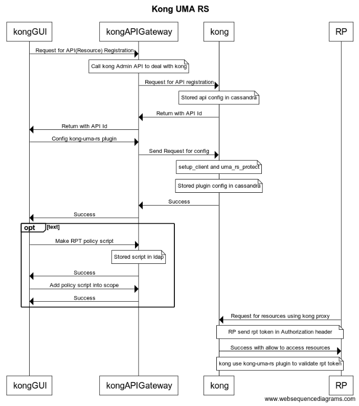
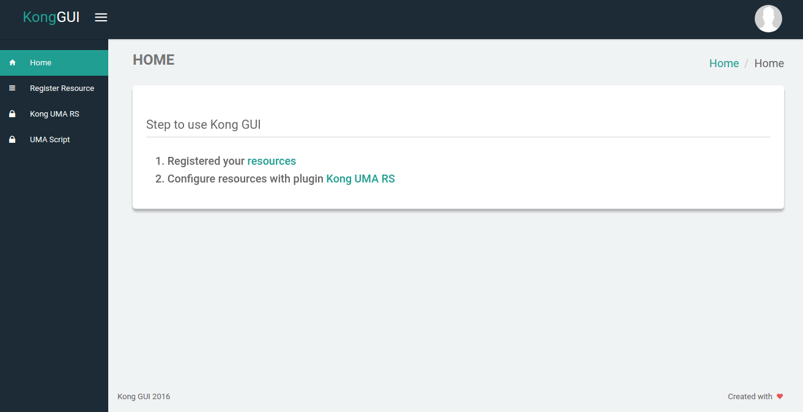
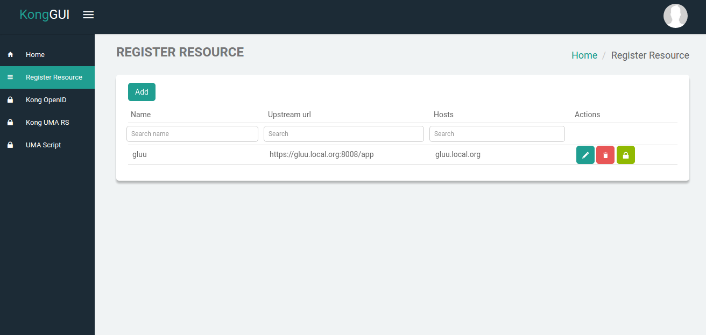
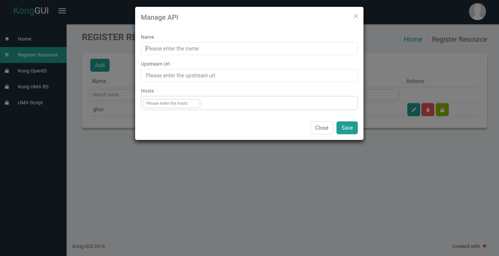
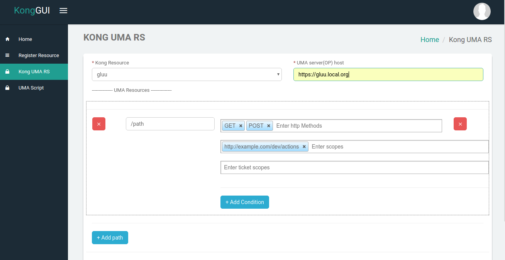
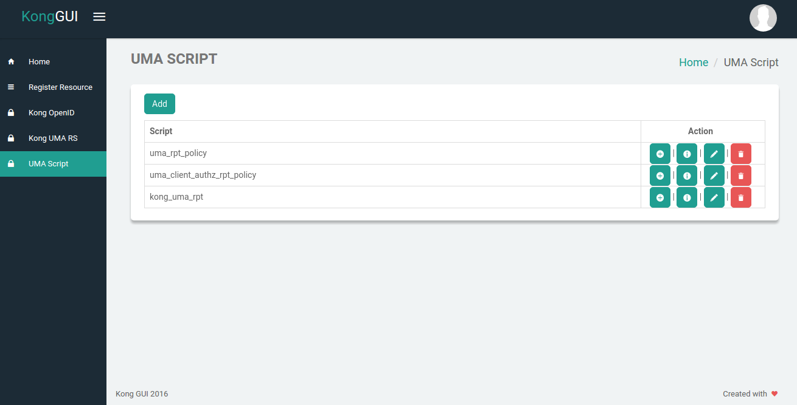
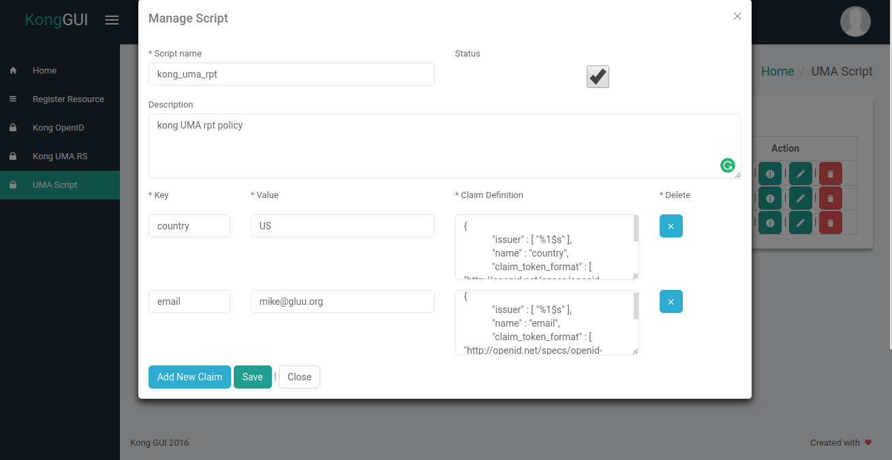
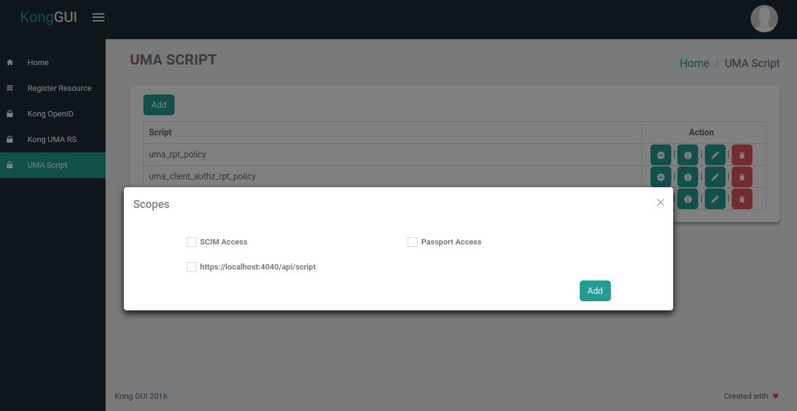

# KongGUI Angular admin panel front-end framework

## Installation
This is assumed that node and npm are installed on the machine.

 * node js >= 6.9.x version
 * npm >= 3.10.x version
 
    ```
    npm install
    ```

## Run for development
```
gulp serve
```

## Deploy on server

Changed the constants in [app.js](https://github.com/GluuFederation/kong-plugins/blob/master/kongGUI/src/app/app.js)
```
 .constant('urls', {
   AUTH_URL: 'https://{{server_url}}/login.html',
   KONG_NODE_API: 'https://{{kongAPIGateway_url}}'
 })
```

Use the `gulp build` command to create the build. It's create the `release` folder. It is like html project and we can deploy it on any http server.
```
gulp build
```

## Sequence flow of system


## Guide for kongGUI

## 1. Welcome page
After successful authentication, the administrator is taken to the Dashboard.


## 2. Register resources
From Register resources tab you can create or register your resources(e.g web application, API application) in the kong.
After registration, you can use [kong proxy](https://getkong.org/docs/0.11.x/proxy/) to access your resources.

* Registered resources list

    We can delete and update resources using `delete` and `edit` button.



* Add resource: Click on `Add` button for add new resource. This provides facility to add resources in the kong.

    1.Name: Required, This field contains the name of the resource(API)
    
    2.Upstream URL: Required, The base target URL that points to your API server. This URL will be used for proxying requests. For example https://example.com

    3.Hosts: Required, A list of domain names that point to your API.
    

     
## 3. kong UMA RS 
From this tab, you can config [kong-uma-rs](https://github.com/GluuFederation/kong-plugins/tree/master/kong-uma-rs).
After configuring the plugin, you can not access the resources directly. [Read more...](https://github.com/GluuFederation/kong-plugins/tree/master/kong-uma-rs#verify-that-your-api-is-protected-by-kong-uma-rs) 

1. Kong Resource: Required, It displays all the resources in dropdown which we registered using above `Register Resources` step.

2. UMA sever(OP) host: Required, UMA Server that implements UMA 2.0 specification. E.g. https://example.gluu.org (For example Gluu Server). Check that UMA implementation is up and running by visiting .well-known/uma-configuration endpoint. E.g. https://example.gluu.org/.well-known/uma-configuration.

3. UMA Resource: This section contains several fields. You can fill value as per instruction(placeholder) in every field. 



## 4. UMA Script
From this tab you can create the UMA RPT policy and assign it to scopes
* List of UMA RPT policies
There are 4 buttons. 
    1. Add script into the scopes
    2. See the sample of script
    3. Edit the script
    4. Delete the script



* Add policy script
This creates the automatic UMA RPT policy. You can add multiple claims using `Add new claim` button and also remove it using remove `x`  button.
    
    1. Script name: This field contains the name of the script.
    2. Status: This field is used to set the status for a script. It must be enabled if you want to execute it at the time of getting RPT token.
    3. Description: This field is used to set the description for a script.
    4. Key: It contains the claim key name.
    5. value: It contains the value of the claim.
    


* Add Script into scope
You can select multiple scope to add script into it.

