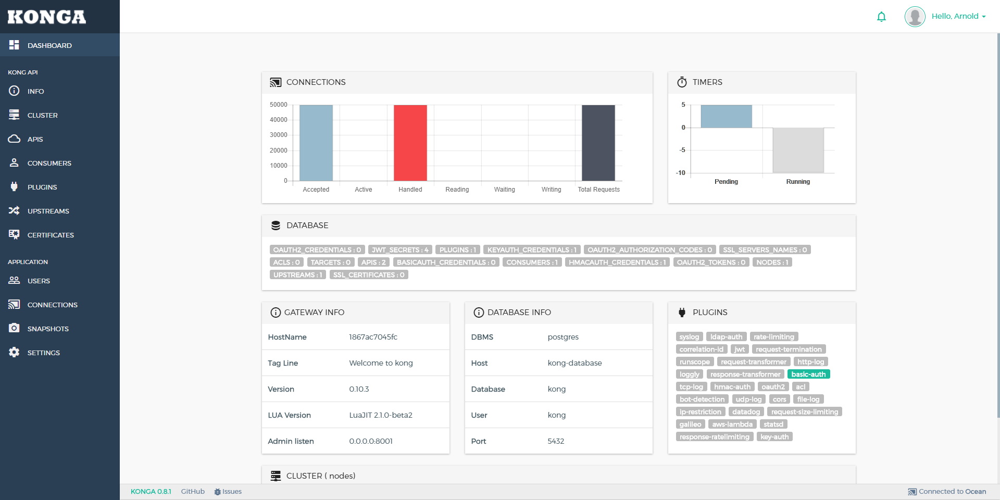

## More than just another GUI to [KONG Admin API](http://getkong.org)    [](https://travis-ci.org/pantsel/konga)    [](https://gitter.im/pantsel-konga/Lobby)

[](screenshots/konga-logo.png?raw=true)


[](screenshots/bc2.png?raw=true)

<em>Konga is not an official app. No affiliation with [Mashape](https://www.mashape.com/).</em>

## Summary

- [**Prerequisites**](#prerequisites)
- [**Used libraries**](#used-libraries)
- [**Installation**](#installation)
- [**Configuration**](#configuration)
- [**Running Konga**](#running-konga)

## Prerequisites
- A running [Kong installation](https://getkong.org/) 
- Nodejs
- Npm

## Used libraries
* Sails.js, http://sailsjs.org/

    Command to install sails js
    ```
    npm install sails -g
    ```

## Installation

Install <code>npm</code> and <code>node.js</code>. Instructions can be found [here](http://sailsjs.org/#/getStarted?q=what-os-do-i-need).

Install <code>bower</code>, <code>gulp</code> and <code>sails</code> packages.
<pre>
$ git clone https://github.com/GluuFederation/kong-plugins
$ cd oxd-kong
$ npm install
</pre>

## Configuration
You can configure your  application to use your environment specified
settings.

This is property file where you need to specify port, oxd, OP and client settings.

<pre>
/config/local.js
</pre>

## Running Konga

### Development
<pre>
$ npm start
</pre>
Konga GUI will be available at http://localhost:1337

#### Login
*Admin*
login: admin | password: adminadminadmin

*Demo user*
login: demo | password: demodemodemo
